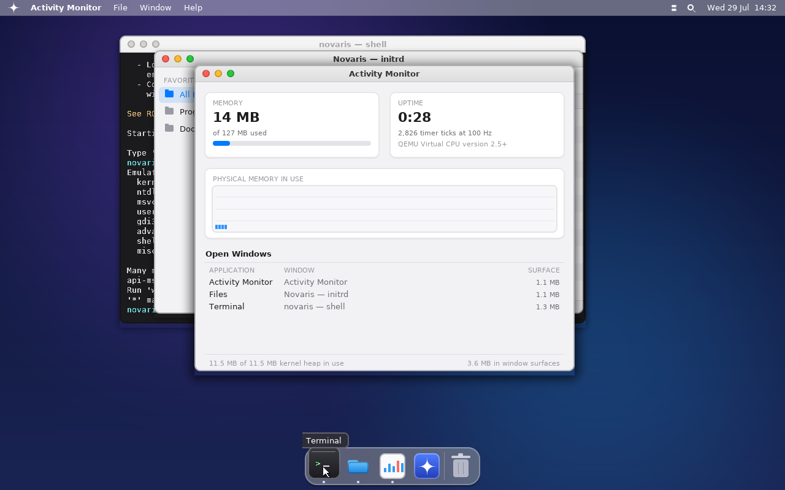

# Novaris

A real, from-scratch, bootable x86 operating system — built incrementally,
one subsystem at a time. This is legally and entirely yours: every line is
either written here or copied from public-domain reference material (the
Multiboot spec), no Windows/macOS/Linux source is used or referenced.

This is **not** a clone of Windows/macOS/Linux — those are billions of lines
of code built by huge teams over decades, and legally reimplementing their
exact behavior (like ReactOS does for Windows) requires careful clean-room
engineering specifically to avoid copyright issues. What we're doing instead
is building a real, simple, original OS the way every OS starts: a
bootloader hands off to a kernel, and the kernel grows from there. Over time
you can shape it to *feel* like whichever OS inspires you (windowing system,
shell conventions, UI style) without copying anyone's code.

## Current status: Milestone 18 complete ✅

- [x] Multiboot bootloader handoff (via GRUB), 32-bit protected mode
- [x] Freestanding C kernel — no libc, we own the whole stack
- [x] Own GDT, IDT, all 32 CPU exception handlers, remapped 8259 PIC
- [x] PIT timer, PS/2 keyboard and mouse drivers
- [x] Higher-half kernel with 4KB paging, a physical frame allocator,
      and a `kmalloc`/`kfree` heap
- [x] Ring 3 user mode via a TSS and an `int 0x80` syscall interface
- [x] Initrd (a GRUB module) behind a VFS layer, plus a tiny libc
- [x] Round-robin preemptive multitasking with real context switching,
      across separate address spaces — plus real threads (several
      preemptively-scheduled contexts sharing one address space)
- [x] **The real Linux/i386 syscall ABI** — a program written for Linux
      (raw `int $0x80`, built with plain `gcc -m32 -static -nostdlib`)
      runs unmodified; `make test-posix` runs the *same binary* on the
      Linux host and on Novaris and diffs the transcripts
- [x] **Real Win32 threads**: a `.exe` can call `CreateThread`, join with
      `WaitForSingleObject`, and be protected by a `CRITICAL_SECTION`
      that actually locks
- [x] ELF32 loader
- [x] **Runs real, unmodified Windows `.exe` files** against an emulated
      Win32 API — see below
- [x] Synchronous kernel → ring-3 callbacks, so the emulated C runtime can
      call a program's own functions: real `qsort`, `bsearch`, `atexit`
      (and C++ global destructors as a side effect)
- [x] Per-process address spaces — every program runs in its own page
      directory, with its image, stack and heap invisible to the kernel's
      own address space (one process at a time; the scheduler does not
      switch CR3 yet)
- [x] **A real windowing desktop**: a compositing window manager with
      draggable, resizable, overlapping windows, a taskbar, a Start menu
      and built-in apps — see below
- [x] **Windows-style windowing**: caption buttons, eight-way resizing,
      Aero-style edge snapping, Alt+Tab, and a taskbar with live window
      previews — see below

See `ROADMAP.md` for the full history and what's next, in order.

## The desktop



*Rendered by `make test`, which drives the real compositor, window manager
and shell on the host — so the chrome, taskbar and icons above are exactly
what boots. The two windows' contents are the test's stand-in apps rather
than the real Terminal and File Explorer, since those need the rest of the
kernel underneath them.*

Novaris boots into a compositing desktop rather than a bare console. The
shell is still there — it's an app now, running in a Terminal window, the
way a shell is on any windowing OS.

What that involves:

- **A compositor** (`kernel/gfx.c`). Every frame is assembled in an
  off-screen 32-bit surface and pushed to the framebuffer in one pass, so
  nothing tears or flickers. A single signed-distance function draws every
  rounded corner, antialiased edge and soft shadow in the UI; a two-pass
  box blur gives the taskbar and the flyouts their frosted backdrops. No
  floating point anywhere — this kernel doesn't save FPU state across
  interrupts, so it's fixed point throughout.
- **A window manager** (`kernel/wm.c`). Each window owns a backing
  surface, so moving one is a blit rather than a request that its app
  redraw everything. Z-order, click-to-focus, drag by the title bar, and
  the Windows chrome: the window's icon and title read from the left, the
  minimize / maximize / close buttons sit flush in the top-right corner
  with the close button turning red under the pointer, and all eight
  edges and corners resize with the pointer changing shape to match.
  Damage tracking is what keeps it usable at 1280x800 in software: a
  blinking terminal cursor repaints ~200 pixels, not a megapixel.
- **Snapping.** Drag a window against the top of the screen to maximize
  it, or against a side to fill half the screen — with a translucent
  preview of where it will land shown before you let go. `Win`+arrows do
  the same from the keyboard. Dragging a snapped window away hands back
  its floating size, positioned so the pointer keeps its grip on the
  title bar.
- **A desktop shell** (`kernel/desktop.c`): a taskbar with the Start
  button, a search field, one button per window with a running indicator
  and a live thumbnail preview on hover, a system tray, and a clock read
  from the CMOS RTC; a Start menu that both launches apps and searches
  them and the initrd; icons on the desktop; right-click context menus on
  the desktop, the taskbar and any title bar; and an Alt+Tab switcher
  showing live thumbnails of every open window.
- **Apps** (`kernel/app_*.c`): Terminal (the kernel shell), File Explorer
  (browses the initrd, opens text files, runs programs), Task Manager
  (live memory, uptime, and every open window's surface cost), About
  Novaris (which reads the processor's own brand string out of CPUID), a
  text viewer, and alert panels.

| Shortcut | What it does |
| --- | --- |
| `Win` | Open or close the Start menu |
| `Win-S` / `Win-R` | Start menu with the search field ready |
| `Alt-Tab` / `Shift-Alt-Tab` | Cycle windows, live thumbnails, commits on release |
| `Alt-F4` | Close the focused window |
| `Alt-Space` | The focused window's system menu |
| `Win-Left` / `Win-Right` | Snap the window to half the screen |
| `Win-Up` / `Win-Down` | Maximize / restore, then minimize |
| `Win-D` | Show the desktop, and put it all back |
| `Win-E` | File Explorer |
| `Ctrl-Shift-Esc` | Task Manager |
| Page Up/Down, End | Scroll the Terminal's scrollback |

The `Win` key is the physical Windows key; `Alt` is Alt. (Milestone 11
treated the two interchangeably, because a macOS-style shell wants one
Command key. A Windows-style one needs them apart: `Alt-Tab` and `Win-Tab`
are different gestures.)

Everything the shell could do before, it still does: typing `run
hellowin.exe` into the Terminal window loads and runs a real Windows
binary, with its output streaming into the window as it is produced. The
kernel also still mirrors every character to COM1, which is how the test
harness drives it.

The two things this deliberately isn't: it is not a GUI *toolkit* — apps
are kernel code with a paint callback, not separate processes talking to a
display server — and it is not reachable from `CreateWindowEx`, which
would need the ability to call back into ring 3 (see `ROADMAP.md`).

## Running Windows programs

Novaris loads PE32 executables and implements enough of the Win32 API
underneath them that ordinary Windows console programs run. The test
binaries in `userland/pe_test/` are compiled with stock `mingw-w64`
against the real Windows headers and import libraries — nothing about
them is written for Novaris, and they would run unchanged on Windows.

```
novaris> run hellowin.exe
Hello from a real Windows .exe running on Novaris!
  compiled by mingw-w64, linked against msvcrt.dll

integers:   42 -7 4000000000 00042 42    | +42
floats:     3.141593 2.50 1.234568e+04 0.0001
heap:       "malloc + strcpy + strlen" (24 bytes)
fib(20):    6765
```

What that involves: the PE loader (`kernel/pe.c`) maps the image, applies
base relocations when it can't have its preferred address, and binds the
import table; the Win32 layer (`kernel/win32*.c`) provides ~500 APIs
across kernel32, msvcrt, ntdll and user32, reached through generated
ring-3 thunks that trap into the kernel on `int 0x81`. `include/win32.h`
explains the mechanism.

Three shell commands drive it:

| Command | What it does |
| --- | --- |
| `run prog.exe` | Loads and runs a program (also handles ELF and flat binaries) |
| `peinfo prog.exe` | Dumps a PE's headers and shows, per symbol, which imports resolve |
| `winapi [module]` | Lists the emulated DLLs, or one module's exports |

`multitask` runs three tasks from the same virtual address in three
different address spaces, and `threadtest` runs two threads in one
address space incrementing a shared counter. `vmtest` demonstrates the
underlying Milestone 14 paging work: two page
directories with different contents at the same virtual address, an
identical kernel half in both, and the kernel still running throughout.

**What this is not**: a Windows clone, a Wine port, or a general-purpose
compatibility layer. There is a window manager now, but no path from
`CreateWindowEx` into it — that needs the ability to call a ring-3 window
procedure, which doesn't exist yet. There is no registry, no networking
and no threads. `ROADMAP.md` Milestone 10 is precise about where
the boundary is and why.

The project has since committed to **Path A** — porting real Wine on top
of Novaris rather than hand-writing more Win32 forever. That is a long
road with forced prerequisites (address spaces, threads, a POSIX-ish
syscall surface, a dynamic linker) and no Wine or ReactOS source is
vendored in until the last of them is done. `ROADMAP.md` has the plan and
is honest about the scope. A GUI program gets an honest failure from
`CreateWindowEx` rather than a blank screen; a 64-bit binary is told it's
64-bit; a program that calls an API Novaris doesn't have prints exactly
which one.

## Project layout

```
novaris/
├── boot/boot.s               # Assembly entry point + Multiboot header
├── kernel/
│   ├── kernel.c               # kernel_main() - C entry point
│   ├── console.c              # Console: framebuffer, VGA, or a window sink
│   ├── vga_text.c             # VGA text-mode fallback driver
│   ├── framebuffer.c, font8x16.c, mouse.c
│   ├── gfx.c                  # Compositor: surfaces, shapes, shadows, text
│   ├── uifont.c               # Generated antialiased UI typeface
│   ├── wm.c                   # Window manager: z-order, input, chrome
│   ├── desktop.c              # Taskbar, Start menu, Alt+Tab, the frame loop
│   ├── icons.c                # Every pictogram, drawn from primitives
│   ├── uikit.c                # Shared widgets for the built-in apps
│   ├── app_terminal.c         # Terminal: the shell, in a window
│   ├── app_files.c            # File Explorer + the text viewer
│   ├── app_monitor.c          # Task Manager
│   ├── app_about.c            # About Novaris + alert panels
│   ├── cpu.c                  # CPUID: vendor, brand string, features
│   ├── gdt.c / gdt_flush.s    # Global Descriptor Table + TSS + TEB
│   ├── idt.c / idt_flush.s    # Interrupt Descriptor Table + dispatch
│   ├── isr.s                  # Exception/IRQ entry stubs (asm)
│   ├── pic.c, pit.c, keyboard.c, serial.c, rtc.c
│   ├── pmm.c / paging.c / kheap.c   # Memory management
│   ├── vfs.c / initrd.c       # Filesystem layer
│   ├── syscall.c              # int 0x80 syscalls
│   ├── process.c / process_asm.s    # Ring 0 <-> ring 3
│   ├── scheduler.c / scheduler_asm.s # Preemptive multitasking
│   ├── elf.c                  # ELF32 loader
│   ├── pe.c                   # PE32 loader: relocations, imports, TLS
│   ├── win32.c                # Win32 core: thunks, dispatch, arenas
│   ├── win32_kernel32.c       # kernel32 + ntdll
│   ├── win32_msvcrt.c         # The C runtime an .exe links against
│   ├── win32_user32.c         # user32, gdi32, advapi32, shell32
│   ├── win32_format.c         # The printf engine
│   ├── win32_dtoa.c           # IEEE-754 double -> decimal
│   └── kstring.c              # Shared string/memory primitives
├── include/                   # One header per subsystem
├── userland/
│   ├── libc/                  # Tiny libc for native Novaris programs
│   ├── pe_test/               # Windows test programs (built with mingw)
│   └── mkinitrd.py            # Packs the initrd image
├── tools/
│   ├── gen_font.py            # Generates the 8x16 terminal font
│   ├── gen_uifont.py          # Generates the antialiased UI faces
│   └── qemu_test.py           # Boots the ISO and drives the shell
├── tests/                     # Host-side tests of kernel code
├── linker.ld                  # Places the kernel at the 1MB mark
├── grub.cfg                   # GRUB menu config baked into the ISO
├── Makefile
└── ROADMAP.md                 # Ordered plan for what to build next
```

## Building

You need: `nasm`, `gcc` (with 32-bit support), `ld`, `grub-mkrescue`,
`xorriso`, `mtools`, and `mingw-w64`. On Ubuntu/Debian:

```bash
apt-get install nasm grub-pc-bin grub-common xorriso mtools \
    qemu-system-x86 build-essential gcc-multilib mingw-w64
```

`mingw-w64` builds only the Windows test programs in `userland/pe_test/`
— the kernel itself has no such dependency. `gcc-multilib` is only needed
for the host-side tests.

```bash
make          # builds build/novaris.bin and novaris.iso
```

## Running it

```bash
make run                 # opens a QEMU window (needs a display)
qemu-system-i386 -cdrom novaris.iso   # same thing, manually
```

The desktop needs a framebuffer and a pointer, so this is the way to
actually use it. Without a usable framebuffer — real hardware with no VBE
support, say — the kernel says so and falls back to the original
text-mode shell, which is still a complete way to drive the machine.

Headless, the kernel mirrors its console to COM1, so a plain serial log
is the easiest way to see what it did:

```bash
qemu-system-i386 -cdrom novaris.iso -display none -serial stdio
```

## Testing

```bash
make test        # host-side tests: the printf engine and the PE loader
make test-qemu   # boots the ISO, drives the shell, asserts on the output
```

`make test` links the *actual* kernel sources into a host binary and
drives them directly — the format engine is checked conversion by
conversion against the host C library's own `printf`, and the PE loader
is run against the real mingw-built binaries, including verifying every
entry in a relocation table it applied. `make test-qemu` boots the ISO in
QEMU, types commands through the QEMU monitor, and matches the serial
transcript against expected output (`tools/qemu_test.py`).

You can also burn `novaris.iso` to a USB stick with a tool like `dd` or Rufus
and boot a **real PC** from it — that's genuinely how far this goes.

## Why it's structured this way

- **Multiboot instead of a hand-written bootloader**: writing your own
  16-bit real-mode bootloader (disk reads, A20 line, GDT, protected mode
  switch) is a whole rabbit hole on its own. Using GRUB via the Multiboot
  spec is what most hobby OS projects (and this one) do first, so we can
  focus energy on the kernel. Writing a custom bootloader is a legitimate
  later milestone if you want it (see ROADMAP.md).
- **C, not the assembly the whole way**: after the tiny entry stub, we
  switch to C as fast as possible because it's dramatically more
  productive for everything else (drivers, memory management, data
  structures).
- **No libc**: a hosted OS's libc assumes an OS underneath it (for
  malloc, file I/O, etc.) — we *are* the OS, so we write our own minimal
  primitives as we need them.
