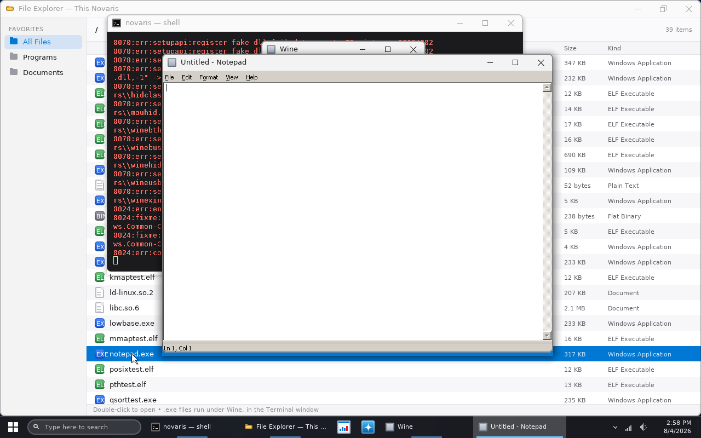

# Novaris

A real, from-scratch, bootable x86 operating system — built incrementally,
one subsystem at a time. This is legally and entirely yours: every line is
either written here or copied from public-domain reference material (the
Multiboot spec), no Windows/macOS/Linux source is used or referenced.

This is **not** a clone of Windows/macOS/Linux — those are billions of lines
of code built by huge teams over decades, and legally reimplementing their
exact behavior (like ReactOS does for Windows) requires careful clean-room
engineering specifically to avoid copyright issues. What we're doing instead
is building a real, simple, original OS the way every OS starts: a
bootloader hands off to a kernel, and the kernel grows from there. Over time
you can shape it to *feel* like whichever OS inspires you (windowing system,
shell conventions, UI style) without copying anyone's code.

## Current status: Milestone 41 complete ✅

- [x] Multiboot bootloader handoff (via GRUB), 32-bit protected mode
- [x] Freestanding C kernel — no libc, we own the whole stack
- [x] Own GDT, IDT, all 32 CPU exception handlers, remapped 8259 PIC
- [x] PIT timer, PS/2 keyboard and mouse drivers
- [x] Higher-half kernel with 4KB paging, a physical frame allocator,
      and a `kmalloc`/`kfree` heap
- [x] Ring 3 user mode via a TSS and an `int 0x80` syscall interface
- [x] Initrd (a GRUB module) behind a VFS layer, plus a tiny libc
- [x] Round-robin preemptive multitasking with real context switching,
      across separate address spaces — plus real threads (several
      preemptively-scheduled contexts sharing one address space)
- [x] **The real Linux/i386 syscall ABI** — a program written for Linux
      (raw `int $0x80`, built with plain `gcc -m32 -static -nostdlib`)
      runs unmodified; `make test-posix` runs the *same binary* on the
      Linux host and on Novaris and diffs the transcripts
- [x] **Real signals** — `rt_sigaction`/`rt_sigprocmask`/`rt_sigreturn`,
      delivery from `kill` and from CPU faults, and a `SIGSEGV` handler
      that can fix the fault and let the faulting instruction be retried
      (the pattern Wine is built on)
- [x] **A real glibc-linked program runs** — an ordinary `gcc -m32 -static`
      binary, hundreds of KB of production C library that has never heard
      of Novaris: its allocator, SSE2 string functions, `printf` and float
      formatting all work, with output identical to Linux
- [x] **Dynamic linking** — a normally linked program runs through the
      real `ld-linux.so.2` loading the real `libc.so.6` at runtime, with
      output identical to Linux
- [x] **POSIX threads** — `clone`, `futex` and per-thread TLS behind `gs`:
      what pthreads is made of, verified with a libc-free program that
      runs identically on Linux and Novaris
- [x] **Real Win32 threads**: a `.exe` can call `CreateThread`, join with
      `WaitForSingleObject`, and be protected by a `CRITICAL_SECTION`
      that actually locks
- [x] ELF32 loader
- [x] **Runs real, unmodified Windows `.exe` files** against an emulated
      Win32 API — see below
- [x] Synchronous kernel → ring-3 callbacks, so the emulated C runtime can
      call a program's own functions: real `qsort`, `bsearch`, `atexit`
      (and C++ global destructors as a side effect)
- [x] Per-process address spaces — every program runs in its own page
      directory, with its image, stack and heap invisible to the kernel's
      own address space (one process at a time; the scheduler does not
      switch CR3 yet)
- [x] **Real signals with real context** — `ucontext_t` and `siginfo_t` in
      Linux's exact layout, in both directions: a handler can read the
      faulting registers *and write them back*, which is the whole of
      Wine's exception dispatch. The x87/SSE half too, so a handler that
      does arithmetic cannot corrupt the interrupted computation.
- [x] **Futexes that really block**, and a writable, hierarchical
      filesystem
- [x] **Unix domain sockets** — `AF_UNIX`/`SOCK_STREAM` with `SCM_RIGHTS`,
      so a descriptor sent over a socket arrives as a descriptor
- [x] **Two processes at once** — `fork`, `vfork`, `execve`, `wait4`,
      pipes, `dup2`, `poll`/`select`, and a POSIX state that is genuinely
      per process rather than a set of globals
- [x] **A real Windows `.exe` runs under real Wine**, threads and all —
      see below
- [x] **A real windowing desktop**: a compositing window manager with
      draggable, resizable, overlapping windows, a taskbar, a Start menu
      and built-in apps — see below
- [x] **Windows-style windowing**: caption buttons, eight-way resizing,
      Aero-style edge snapping, Alt+Tab, and a taskbar with live window
      previews — see below
- [x] **A real disk and a real filesystem** — an ATA PIO driver and FAT32
      written from scratch, mounted at `/disk`. Files written on one boot
      are there on the next; `make test-qemu-disk` is exactly that test.
      The image is an ordinary FAT32 volume, so it can be mounted and
      inspected on the host — see below
- [x] **Symbolic links**, on disk and in RAM, byte-identical to Linux —
      which is what Wine's DOS drive table is made of
- [x] **Copy-on-write private file mappings** — `MAP_PRIVATE` on a file
      is the file's own memory until this process writes to a page, one
      page at a time, which is what Linux means by it and what Wine's
      shared session block is built on
- [x] **A Windows `.exe` runs under Wine on the real startup path** —
      window classes registered, a desktop window created, services and
      explorer started, and the program's own path resolved through the
      prefix's DOS drive table — see below
- [x] **Wine is installed in the OS, not bolted onto it** — one ISO, with
      Wine at `/usr/lib/wine` and `/usr/share/wine` the way any Unix has
      it. Which is what lets Wine find `wine.inf` and **build its own
      prefix on Novaris**: `wine hellowin.exe`, on a fresh boot, with no
      disk and nothing set up beforehand
- [x] **Double-clicking a `.exe` runs it under Wine** — in the File
      Explorer, which browses directories now. `make test-desktop` is
      three mouse gestures and no keyboard at all
- [x] **A ring-3 process can own a window** — `/dev/wm`: open it, ask for
      a size, `mmap` the pixels, and the compositor reads the memory the
      process draws into. Every window before this one was drawn by kernel
      code. `make test-wm`
- [x] **A Windows program opens in a window** — Notepad, under real Wine,
      through Novaris's own Wine display driver
      (`wine/winenovaris.drv`, `make test-wine-gui`). Double-click it in
      the File Explorer and it opens, with nothing typed — see below
- [x] **Networking** — PCI, an RTL8139 driver, Ethernet/ARP/IPv4/ICMP/UDP,
      DHCP, TCP, DNS and HTTP, all written from scratch. `net up` gets an
      address, `ping` answers, and `fetch` pulls 2,000,000 bytes in 110ms
- [x] **An OS that updates itself** — `update apply <manifest-url>`
      downloads a kernel and an initrd, verifies both before writing
      either, and writes the version marker last, so GRUB boots the
      disk's copy on the next reboot. `tools/tests/update_e2e.sh` proves
      it the only way an updater can be proven: by rebooting into the
      version it installed
- [x] **Sockets a program can call** — `AF_INET`, streams and datagrams
      both, over the same i386 `socketcall` ABI. A Linux binary built
      against nothing that has heard of Novaris opens a TCP connection
      from ring 3, and asks a real nameserver a real question over UDP.
      `make test-inet`

See `ROADMAP.md` for the full history and what's next, in order.

## A Windows program, in a window



*`make test-desktop-gui`: three mouse gestures, no keyboard. The File
Explorer with `notepad.exe` selected, the Terminal behind it showing
Wine building its prefix, and Notepad — a real Windows binary, run by
real Wine — in a window the Novaris compositor drew.*

Every pixel of that window went: GDI → a window surface → the driver's
`flush()` → a `MAP_SHARED` mapping of `/dev/wm` → the compositor's blit →
the framebuffer. Input comes back the other way through
`NtUserSendHardwareInput`, the same call X11 and Wayland make, so above
the driver there is no difference between a click here and a click on X.

The menu bar, the scroll bar and the status bar are real: Wine's own
TrueType faces ship in the image and win32u rasterises them with
FreeType. That mattered for more than the text — with no font engine
Wine's caption metrics are uninitialised stack, and a window's *frame* is
measured from them, so the first version of this had a title bar six and
three quarter million pixels tall. `ROADMAP.md`'s Milestone 37 traces it.

## The desktop


*Rendered by `make test`, which drives the real compositor, window manager
and shell on the host — so the chrome, taskbar and icons above are exactly
what boots. The two windows' contents are the test's stand-in apps rather
than the real Terminal and File Explorer, since those need the rest of the
kernel underneath them.*

Novaris boots into a compositing desktop rather than a bare console. The
shell is still there — it's an app now, running in a Terminal window, the
way a shell is on any windowing OS.

What that involves:

- **A compositor** (`kernel/gfx.c`). Every frame is assembled in an
  off-screen 32-bit surface and pushed to the framebuffer in one pass, so
  nothing tears or flickers. A single signed-distance function draws every
  rounded corner, antialiased edge and soft shadow in the UI; a two-pass
  box blur gives the taskbar and the flyouts their frosted backdrops. No
  floating point anywhere — this kernel doesn't save FPU state across
  interrupts, so it's fixed point throughout.
- **A window manager** (`kernel/wm.c`). Each window owns a backing
  surface, so moving one is a blit rather than a request that its app
  redraw everything. Z-order, click-to-focus, drag by the title bar, and
  the Windows chrome: the window's icon and title read from the left, the
  minimize / maximize / close buttons sit flush in the top-right corner
  with the close button turning red under the pointer, and all eight
  edges and corners resize with the pointer changing shape to match.
  Damage tracking is what keeps it usable at 1280x800 in software: a
  blinking terminal cursor repaints ~200 pixels, not a megapixel.
- **Snapping.** Drag a window against the top of the screen to maximize
  it, or against a side to fill half the screen — with a translucent
  preview of where it will land shown before you let go. `Win`+arrows do
  the same from the keyboard. Dragging a snapped window away hands back
  its floating size, positioned so the pointer keeps its grip on the
  title bar.
- **A desktop shell** (`kernel/desktop.c`): a taskbar with the Start
  button, a search field, one button per window with a running indicator
  and a live thumbnail preview on hover, a system tray, and a clock read
  from the CMOS RTC; a Start menu that both launches apps and searches
  them and the initrd; icons on the desktop; right-click context menus on
  the desktop, the taskbar and any title bar; and an Alt+Tab switcher
  showing live thumbnails of every open window.
- **Apps** (`kernel/app_*.c`): Terminal (the kernel shell), File Explorer
  (browses the initrd, opens text files, runs programs), Task Manager
  (live memory, uptime, and every open window's surface cost), About
  Novaris (which reads the processor's own brand string out of CPUID), a
  text viewer, and alert panels.

| Shortcut | What it does |
| --- | --- |
| `Win` | Open or close the Start menu |
| `Win-S` / `Win-R` | Start menu with the search field ready |
| `Alt-Tab` / `Shift-Alt-Tab` | Cycle windows, live thumbnails, commits on release |
| `Alt-F4` | Close the focused window |
| `Alt-Space` | The focused window's system menu |
| `Win-Left` / `Win-Right` | Snap the window to half the screen |
| `Win-Up` / `Win-Down` | Maximize / restore, then minimize |
| `Win-D` | Show the desktop, and put it all back |
| `Win-E` | File Explorer |
| `Ctrl-Shift-Esc` | Task Manager |
| Page Up/Down, End | Scroll the Terminal's scrollback |

The `Win` key is the physical Windows key; `Alt` is Alt. (Milestone 11
treated the two interchangeably, because a macOS-style shell wants one
Command key. A Windows-style one needs them apart: `Alt-Tab` and `Win-Tab`
are different gestures.)

Everything the shell could do before, it still does: typing `run
hellowin.exe` into the Terminal window loads and runs a real Windows
binary, with its output streaming into the window as it is produced. The
kernel also still mirrors every character to COM1, which is how the test
harness drives it.

The two things this deliberately isn't: it is not a GUI *toolkit* — apps
are kernel code with a paint callback, not separate processes talking to a
display server — and it is not reachable from `CreateWindowEx`, which
would need the ability to call back into ring 3 (see `ROADMAP.md`).

## Running Windows programs

Novaris loads PE32 executables and implements enough of the Win32 API
underneath them that ordinary Windows console programs run. The test
binaries in `userland/pe_test/` are compiled with stock `mingw-w64`
against the real Windows headers and import libraries — nothing about
them is written for Novaris, and they would run unchanged on Windows.

```
novaris> run hellowin.exe
Hello from a real Windows .exe running on Novaris!
  compiled by mingw-w64, linked against msvcrt.dll

integers:   42 -7 4000000000 00042 42    | +42
floats:     3.141593 2.50 1.234568e+04 0.0001
heap:       "malloc + strcpy + strlen" (24 bytes)
fib(20):    6765
```

What that involves: the PE loader (`kernel/pe.c`) maps the image, applies
base relocations when it can't have its preferred address, and binds the
import table; the Win32 layer (`kernel/win32*.c`) provides ~500 APIs
across kernel32, msvcrt, ntdll and user32, reached through generated
ring-3 thunks that trap into the kernel on `int 0x81`. `include/win32.h`
explains the mechanism.

Seven shell commands drive it:

| Command | What it does |
| --- | --- |
| `run prog.exe` | Loads and runs a program (also handles ELF and flat binaries) |
| `wine prog.exe` | Runs it under *real* Wine instead, through the copy installed at `/usr/bin/wine` |
| *(double-click)* | The File Explorer and the Start menu's search do the same thing without the typing — a `.exe` goes to Wine when Wine is installed |
| `peinfo prog.exe` | Dumps a PE's headers and shows, per symbol, which imports resolve |
| `winapi [module]` | Lists the emulated DLLs, or one module's exports |
| `strace prog [args]` | The same as `run`, with every syscall logged |
| `ps` | The process table — `fork` gave it more than one row |
| `setenv NAME=VALUE`, `env` | The environment programs are started with |

`multitask` runs three tasks from the same virtual address in three
different address spaces, and `threadtest` runs two threads in one
address space incrementing a shared counter. `vmtest` demonstrates the
underlying Milestone 14 paging work: two page
directories with different contents at the same virtual address, an
identical kernel half in both, and the kernel still running throughout.

**What this is not**: a Windows clone or a general-purpose compatibility
layer. There is a window manager, but no path from `CreateWindowEx` into
it — that needs the ability to call a ring-3 window procedure.
`ROADMAP.md` Milestone 10 is precise about where the boundary is and why.

## Running real Wine

The project committed to **Path A** — porting real Wine on top of Novaris
rather than hand-writing more Win32 forever. That road has forced
prerequisites, and they are now built: per-process address spaces, real
threads, the Linux/i386 syscall ABI, signals with a writable `ucontext`,
a dynamic linker, Unix sockets with `SCM_RIGHTS`, `fork`/`execve`/`wait4`,
`poll`, and shared file mappings.

**A real Windows program runs to completion under Wine 11.0 on Novaris**,
and since Milestone 35 that is the whole of it — one command, on a fresh
boot, with no disk and nothing set up beforehand:

```
novaris> wine hellowin.exe
Hello from a real Windows .exe running on Novaris!
  compiled by mingw-w64, linked against msvcrt.dll

integers:   42 -7 4000000000 00042 42    | +42
hex/octal:  beef BEEF 0xbeef 10
floats:     3.141593 2.50 1.234568e+04 0.0001
64-bit:     1234567890123
heap:       "malloc + strcpy + strlen" (24 bytes)
fib(20):    6765
argc:       1, argv[0]: Z:\hellowin.exe

Exiting with code 0.
```

That is `userland/pe_test/hello_win.c` — an ordinary mingw-w64 program
linked against the real msvcrt import library, the *same binary* the
hand-written Win32 layer runs — going instead through Wine's own PE
ntdll, kernel32, kernelbase and msvcrt, with a wineserver process behind
it. Novaris processes passing file descriptors over a Unix socket.
`make test-wine` asserts eleven lines of it.

`Z:\hellowin.exe` is the detail that says how much is real. `Z:\` is a
DOS drive, and the drive table is made of symbolic links inside a Wine
prefix — a prefix Wine built for itself, on Novaris, a minute earlier, by
running `wineboot` and `rundll32` over its own `wine.inf`.

**And a *threaded* one, since Milestone 31:**

```
novaris> wine threads.exe
Win32 threads test - real CreateThread on Novaris

created worker 1, thread id 56
created worker 2, thread id 60
created worker 3, thread id 64

  worker 1 starting, GetCurrentThreadId() = 56
  worker 2 starting, GetCurrentThreadId() = 60
  worker 3 starting, GetCurrentThreadId() = 64
  worker 1 done
  worker 2 done
  worker 3 done

all 3 workers joined
  worker 1 exit code 100
  worker 2 exit code 200
  worker 3 exit code 300

interlocked counter: 60, expected 60  -> ok
guarded counter:     60, expected 60  -> ok
```

Every Win32 thread there is a real pthread on a real `clone()`. The two
counters are the point: the interlocked one proves the workers all ran
and every increment landed, and the guarded one is incremented with a
deliberately racy read-modify-write, so it only comes out at 60 if the
critical section really serialised three threads. `make
test-wine-threads` asserts eleven lines of it.

Wine is not vendored; it is a build input, fetched and built separately
and pointed at with `WINE_BUILD`. Installed *into* the OS image, but not
committed to this tree: `novaris.iso` stays reproducible from what is
here, and several hundred megabytes of LGPL source in a hobby kernel's
repository would be both bloat and a licensing question nobody needs.
`ROADMAP.md` Milestones 30 and 31 have
the full account — the six things `MAP_SHARED` was hiding, why a Wine
thread cannot inherit one TLS descriptor when Linux gives it three, and
why `poll` waking on the wrong socket looked like threads being slow.

**Since Milestone 32 there is a disk, and Wine's prefix lives on it.**
With a disk attached, `$HOME` is `/disk`, so a prefix is real storage
rather than a few hundred nodes that vanish at the next boot. Symbolic
links are on, so Wine has its DOS drive table: it names the prefix
`Z:\disk\.wine` instead of reporting that it cannot find a DOS drive for
the working directory, which is what every milestone before this one
got. It starts `wineserver`, runs `wineboot`, starts `services.exe`, and
loads its PE builtins straight off the disk — `sum` on
`/disk/.wine/drive_c/windows/system32/gdi32.dll` inside Novaris gives the
same checksum the host does, over the same 514,062 bytes.

**That failure is now understood.** It read as a problem with shell32 and
was four problems elsewhere, none of them about image formats: a shared
library (`libm.so.6`) that was never staged, so `win32u.so` could not be
loaded and neither gdi32 nor user32 could initialise; an mmap arena that
was a bump pointer and never reused an address, so long-lived processes
ran out of address space and a PE loader reported that as an invalid
image; an ELF stack at `0x40100000`, which made Wine conclude the stack
was not near the top of memory and try to reserve into the kernel's half;
and a four-entry, *global* table of shared-mapping references, past which
a mapped file could be freed under a live mapping. All four are fixed and
`ROADMAP.md` Milestone 33 has the full account of how each was found.

**And since Milestone 34, Wine's window classes and its desktop window
work.** What had stopped them was `NtUserRegisterClassExWOW` failing to
get its shared session object, sixteen times a run, in every process —
read as two processes' `MAP_SHARED` views of one file disagreeing. It was
not that. The client's view was never `MAP_SHARED`: Wine maps a read-only
section view with `MAP_PRIVATE` and says why in a comment —

```c
/* changes to the file are not guaranteed to be visible in read-only
 * MAP_PRIVATE mappings, but they are on Linux so we take advantage of it */
```

— and Novaris answered `MAP_PRIVATE` by allocating pages and reading the
bytes in, which is a snapshot. So win32u read the objects wineserver had
written *so far* and never saw another one.

**Private file mappings are copy-on-write now**, which is what
`MAP_PRIVATE` actually means: the frames are the file's until this process
writes to one, and then only that page becomes its own. Two page-table
bits and a fault handler; `fork` needed no change, because it already
shared those frames rather than copying them. `userland/mmap_test.c`
sections 4a and 4b pin it down against Linux, and the second cause behind
the invalid-image-format reports that would not stay still turned out to
be a process running out of its 128 file descriptors while loading DLLs
(512 now, and `RLIMIT_NOFILE` says so rather than answering "unlimited").

Against the same prefix image, the difference over a whole run:

| | before | after |
| --- | --- | --- |
| `Failed to get shared session object` | 16 | 0 |
| `failed to create desktop window` | 17 | 0 |
| `service ... failed to start` (timeout) | 4 | 0 |
| `Loading library ... failed (c000011f)` | yes | 0 |

`ROADMAP.md` Milestone 34 has the full account, including the two bugs
the change itself introduced and how each was found.

**And since Milestone 35, Wine is installed in the OS rather than bolted
onto it.** Up to Milestone 34 there were two ISOs, and the Wine one
carried Wine's files as a heap at the root of a flat initrd: `/ntdll.so`,
`/gdi32.dll`, `/wine-preloader`, `/passwd`. That worked because the kernel
matches the last component of a path whose directories do not exist — but
Wine finds itself by where `ntdll.so` was loaded and derives everything
else from it by *relative* arithmetic, so with `ntdll.so` at `/` every one
of those came out wrong:

| what Wine computes | where it should land | what it got |
| --- | --- | --- |
| `dll_dir` — the builtins | `/usr/lib/wine` | `/` |
| `bin_dir` — wineserver | `/usr/bin` | `//../../bin` |
| `data_dir` — `wine.inf`, NLS | `/usr/share/wine` | nothing at all |

The last one is the one that mattered. A path that does not resolve has no
NT form, so `WINEDATADIR` was never set, so wineboot could not find
`wine.inf`, so **a prefix could never be built** — it had to be built by
the same Wine on a host and written into a disk image.

So Wine is installed now, at the paths `make install` uses:

```
/usr/lib/wine/i386-unix/     ntdll.so, win32u.so, wine, wine-preloader
/usr/lib/wine/i386-windows/  the PE builtins
/usr/bin/                    wine, wineserver
/usr/share/wine/             wine.inf, nls/
/lib32/, /lib/, /etc/        the host C library, passwd, nsswitch.conf
```

The initrd grew directories to make that possible (a path per entry
instead of a 60-byte name), the kernel makes `/root` beside `/tmp` and
`/disk` for `$HOME` to point at, and `utimensat` is implemented because
setupapi sets the times on every file it copies. With all of that, Wine
runs `wineboot`, `wineboot` runs `rundll32` over `wine.inf`, and the
prefix is built on Novaris by Wine.

One ISO, then. `make` builds the OS; with `WINE_BUILD` pointing at a built
Wine, `make` installs Wine into it. Without, the same OS builds without
Wine and the `wine` command says so rather than failing three layers down.

Since Milestone 37 there **is** a display backend, and it is in this
repository: `wine/winenovaris.drv`, a real Wine display driver in two
halves that `tools/build_wine_driver.sh` grafts into a Wine tree. It
answers `pCreateWindowSurface` with a DIB, `pWindowPosChanged` by opening
`/dev/wm`, and sends input back through `NtUserSendHardwareInput` — the
same call X11 and Wayland make, so from `user32` upwards there is no
difference between a click on a Novaris window and a click on an X11 one.
`err:winediag:nodrv_CreateWindow` in an old transcript was honest; it is
now a regression, and `make test-wine-gui` rejects it.

What is still true is that it is **slow**: wineboot takes longer than the
five minutes Wine allows for its own boot event, so a successful run
contains `err:environ:run_wineboot`. Most of that is having no page cache
— a mapped DLL is read in full and copied into the heap, per file.

And `nsiproxy` and `NDIS` still fail to start, which is worth stating
precisely rather than as "no networking". Since Milestone 41 a process
*can* open a TCP connection and send a UDP datagram — `AF_INET` through
the same `socketcall` ABI as the Unix sockets wineserver already runs on.
What those two want is not BSD sockets but NT device objects and an `AFD`
driver, so this is a step toward Wine networking rather than the arrival
of it.

## The disk

```
novaris> df
  ata0  256MB  QEMU HARDDISK
  /disk  FAT32 on ata0 label "NOVARIS"
         12MB used, 243MB free, 4096 bytes/cluster
  sectors read 1841, written 96

novaris> mkdir /disk/notes
novaris> cp readme.txt /disk/notes/kept.txt
novaris> ln -s notes/kept.txt /disk/shortcut
linked /disk/shortcut -> notes/kept.txt
novaris> sync
synced
```

Reboot, and all three are still there. `make test-qemu-disk` is that
sentence as a test: it boots, writes, syncs, powers the machine off,
boots again and reads everything back.

The filesystem is ordinary FAT32, so the image can be mounted and read on
any other machine — which is most of why FAT32 was chosen, since a driver
agreeing with itself is not evidence. `tools/mkfat32.py` builds an image
from a directory tree and is a completely separate implementation of the
format from the kernel's; `tests/fat32_host_test.c` links the *real*
driver into a host binary, points it at an image the tool wrote, and runs
64 checks through it including an unmount and remount. Then `fsck.vfat`
looks at the result, which is the strongest check available here — it has
never heard of Novaris, and it walks every cluster chain, directory entry
and long-name checksum on the volume.

```bash
make disk          # an empty 256MB FAT32 volume, novaris-disk.img
make run-disk      # boot the ISO with it attached
make test-qemu-disk
```

A file on the disk costs a VFS node until something opens it, and only
then its bytes — which is the whole point. The initrd charged forty
megabytes for every file whether or not anything read it; a Wine prefix
of a thousand files costs a few hundred kilobytes until it is used.

## Networking, and an OS that updates itself

```
novaris> net up
Asking for an address (DHCP)...
[OK] address 10.0.2.15, gateway 10.0.2.2, dns 10.0.2.3

novaris> ping 10.0.2.2
reply from 10.0.2.2: seq 1, 0ms

novaris> fetch http://example.com/big.bin /disk/big.bin
HTTP 200, 2000000 bytes of 2000000 from 10.0.2.2 in 110ms
Wrote 2000000 bytes to /disk/big.bin
```

All of it written from scratch: PCI enumeration, an RTL8139 driver,
Ethernet, ARP, IPv4, ICMP, UDP, DHCP, TCP, DNS and HTTP/1.0. The card was
chosen for being the *smallest* real Ethernet controller rather than the
best one — receive is a single circular buffer and transmit is four
registers — because the interesting part is the stack above it.

No TLS, deliberately. TLS is a certificate store, a chain validator and
three ciphersuites; shipping a client that says "https" while checking
nothing would be worse than not having one.

### The bug that was worth the whole milestone

The first working version ran at **8.2 KB/s**, and it looked like
slowness rather than breakage. A packet capture showed the shape:
segments arrived in a burst, nothing went back for a second and a half,
and then — in the same millisecond as the sender's retransmission — an
acknowledgement covering all of them. Every stall had that shape, and
each was twice as long as the last, because it was the sender's timer
that ended it.

```c
if (c->ack_pending && send_ack(c)) c->ack_pending = 0;   /* wrong */
```

`ack_pending` is set by the receive path, which runs in the card's
interrupt. Clearing it *after* `send_ack()` returns erases a request that
arrived *during* the send — which is exactly what happens while a burst
is being acknowledged. Nobody asked again, because asking is what the
flag was for. Clearing it before the send cannot lose one.

Counters are what found it, and `net` still prints them: over one
transfer the tick ran 416 times, failed to send *none*, and yet only five
acknowledgements left the machine for fourteen segments. The loop was
running and the transmitter was fine.

### Updating

```
novaris> update apply http://example.com/latest.manifest
Available: Novaris 41 (version 41)
Installed: Milestone 40 (version 40)
Downloading...
  initrd: 47154K of 47154K (100%)
  kernel: 466660 of 466660 bytes, fnv1a 645a5079 (want 645a5079)
  initrd: 48286649 of 48286649 bytes, fnv1a f01555ff (want f01555ff)
Writing to /disk/boot...
[OK] Update installed to /disk/boot.
```

Both images are downloaded and both verified **before either is
written**, because the failure being designed against is a machine with
half an update on it: a new kernel with an old initrd does not boot, and
a machine that does not boot cannot be updated again. The version marker
is written **last**, so its presence is what says the two images beside
it are complete.

GRUB reads FAT32 natively, so nothing is installed on the disk — the disc
stays the thing that boots and the disk holds what it boots *into*:

```
if search --no-floppy --file --set=root /boot/version; then ... fi
```

The checksum is FNV-1a 32 — a hash, not a signature. It catches a
truncated or corrupted download and nothing at all about who served it;
over plain HTTP this trusts the network, and `include/update.h` says so.

An updater is the one thing that cannot be tested by reading its own
output, because what it claims to have done and what it did are the same
sentence. `tools/tests/update_e2e.sh` builds the tree twice, serves the
newer build, installs it from inside the guest, and boots again — and the
machine comes back up saying `This is Novaris Milestone 41 (version 41)`.

## Project layout

```
novaris/
├── boot/boot.s               # Assembly entry point + Multiboot header
├── kernel/
│   ├── kernel.c               # kernel_main() - C entry point
│   ├── console.c              # Console: framebuffer, VGA, or a window sink
│   ├── vga_text.c             # VGA text-mode fallback driver
│   ├── framebuffer.c, font8x16.c, mouse.c
│   ├── gfx.c                  # Compositor: surfaces, shapes, shadows, text
│   ├── uifont.c               # Generated antialiased UI typeface
│   ├── wm.c                   # Window manager: z-order, input, chrome
│   ├── desktop.c              # Taskbar, Start menu, Alt+Tab, the frame loop
│   ├── icons.c                # Every pictogram, drawn from primitives
│   ├── uikit.c                # Shared widgets for the built-in apps
│   ├── app_terminal.c         # Terminal: the shell, in a window
│   ├── app_files.c            # File Explorer + the text viewer
│   ├── app_monitor.c          # Task Manager
│   ├── app_about.c            # About Novaris + alert panels
│   ├── cpu.c                  # CPUID: vendor, brand string, features
│   ├── gdt.c / gdt_flush.s    # Global Descriptor Table + TSS + TEB
│   ├── idt.c / idt_flush.s    # Interrupt Descriptor Table + dispatch
│   ├── isr.s                  # Exception/IRQ entry stubs (asm)
│   ├── pic.c, pit.c, keyboard.c, serial.c, rtc.c
│   ├── pmm.c / paging.c / kheap.c   # Memory management
│   ├── vfs.c / initrd.c       # Filesystem layer
│   ├── syscall.c              # int 0x80 syscalls
│   ├── posix.c                # the Linux/i386 syscall ABI
│   ├── posix_proc.c           # the process table, keyed by address space
│   ├── posix_signal.c         # signal delivery, sigframes, ucontext
│   ├── posix_thread.c         # clone, futex, TLS
│   ├── socket.c               # Unix domain sockets, SCM_RIGHTS, pipes
│   ├── ata.c                  # ATA PIO driver: the disk
│   ├── blockdev.c             # The block-device registry under FAT32
│   ├── fat32.c                # FAT32: files, directories, long names
│   ├── ramfs.c                # The in-memory filesystem, and path walking
│   ├── pci.c                  # PCI bus scan, BARs, bus mastering
│   ├── rtl8139.c              # The network card
│   ├── net.c                  # Ethernet, ARP, IPv4, ICMP, UDP
│   ├── dhcp.c                 # An address, asked for rather than assumed
│   ├── tcp.c                  # TCP: connections, sequencing, retransmits
│   ├── dns.c                  # A records, and compression pointers
│   ├── http.c                 # HTTP/1.0, into memory
│   ├── update.c               # The updater: manifest, verify, install
│   ├── wmdev.c                # /dev/wm: a window and its pixels, for a process
│   ├── process.c / process_asm.s    # Ring 0 <-> ring 3
│   ├── scheduler.c / scheduler_asm.s # Preemptive multitasking
│   ├── elf.c                  # ELF32 loader
│   ├── pe.c                   # PE32 loader: relocations, imports, TLS
│   ├── win32.c                # Win32 core: thunks, dispatch, arenas
│   ├── win32_kernel32.c       # kernel32 + ntdll
│   ├── win32_msvcrt.c         # The C runtime an .exe links against
│   ├── win32_user32.c         # user32, gdi32, advapi32, shell32
│   ├── win32_format.c         # The printf engine
│   ├── win32_dtoa.c           # IEEE-754 double -> decimal
│   └── kstring.c              # Shared string/memory primitives
├── include/                   # One header per subsystem
├── userland/
│   ├── libc/                  # Tiny libc for native Novaris programs
│   ├── pe_test/               # Windows test programs (built with mingw)
│   └── mkinitrd.py            # Packs the initrd image
├── tools/
│   ├── gen_font.py            # Generates the 8x16 terminal font
│   ├── gen_uifont.py          # Generates the antialiased UI faces
│   ├── mkfat32.py             # Builds a FAT32 image from a directory
│   ├── install_wine.sh        # Installs Wine into the OS image
│   ├── check_wine_installed.py # Refuses a Wine test on an image without it
│   └── qemu_test.py           # Boots the ISO and drives the shell
├── tests/                     # Host-side tests of kernel code
├── linker.ld                  # Places the kernel at the 1MB mark
├── grub.cfg                   # GRUB menu config baked into the ISO
├── Makefile
└── ROADMAP.md                 # Ordered plan for what to build next
```

## Building

You need: `nasm`, `gcc` (with 32-bit support), `ld`, `grub-mkrescue`,
`xorriso`, `mtools`, and `mingw-w64`. On Ubuntu/Debian:

```bash
apt-get install nasm grub-pc-bin grub-common xorriso mtools \
    qemu-system-x86 build-essential gcc-multilib mingw-w64
```

`mingw-w64` builds only the Windows test programs in `userland/pe_test/`
— the kernel itself has no such dependency. `gcc-multilib` is only needed
for the host-side tests.

Nothing extra is needed for the disk: `tools/mkfat32.py` is plain Python
with no dependencies, and QEMU's built-in IDE controller is what the ATA
driver talks to.

```bash
make          # builds build/novaris.bin and novaris.iso
```

To have Wine in it, point `WINE_BUILD` at a built Wine tree and build the
same target — there is one ISO and Wine is installed into it:

```bash
sudo apt-get install libfreetype-dev:i386        # see below - not optional
git clone --depth 1 -b stable https://github.com/wine-mirror/wine
cd wine && CC="gcc -m32" ./configure --enable-archs=i386 \
    --disable-tests --without-x --without-vulkan --without-opengl \
    && make -j4
cd ../NovarisOS && make WINE_BUILD=../wine
```

**FreeType is not optional, however headless this looks.** Configuring
`--without-freetype` builds a Wine that starts, runs, and draws a window
that is 952 pixels wide and *one pixel tall*, with no error anywhere.
win32u derives `SM_CYCAPTION` from the caption font's `tm.tmHeight`, and
with no font engine that height is garbage — so the window manager is
asked for a client area of a negative size and does the arithmetic
faithfully. It cost most of a session to find, twice blamed on the
display driver, and the symptom names nothing that would lead you here.
`tools/install_wine.sh` ships the 32-bit FreeType and Wine's own `.ttf`
files into the image alongside the DLLs.

Without it, `make` builds the same OS without Wine, and the `wine` command
in the shell says so rather than failing three layers down.

## Running it

```bash
make run                 # opens a QEMU window (needs a display)
make run-disk            # ... with a FAT32 disk attached at /disk
qemu-system-i386 -cdrom novaris.iso   # same thing, manually
```

The desktop needs a framebuffer and a pointer, so this is the way to
actually use it. Without a usable framebuffer — real hardware with no VBE
support, say — the kernel says so and falls back to the original
text-mode shell, which is still a complete way to drive the machine.

Headless, the kernel mirrors its console to COM1, so a plain serial log
is the easiest way to see what it did:

```bash
qemu-system-i386 -cdrom novaris.iso -display none -serial stdio
```

## Testing

```bash
make test        # host-side tests: printf, the PE loader, FAT32, the WM
make test-qemu   # boots the ISO, drives the shell, asserts on the output
make test-qemu-disk      # writes to the disk, reboots, reads it back
make test-posix  # runs ten binaries on Linux AND Novaris, diffs the two
make test-wine   # types 'wine hellowin.exe' at the shell and asserts the output
make test-wine-threads   # ... and a *threaded* Windows .exe's
make test-wine-prefix    # ... on an empty disk, where Wine builds its prefix
make test-desktop        # ... by double-clicking it, with the mouse, on the desktop
make test-wine-persist   # ... twice, across a reboot, on a prefix that survived
                         #     (the Wine tests need WINE_BUILD set when the ISO was built)
make test-wine-gui       # ... and asserts the *window* from a screendump
make test-desktop-gui    # ... opened by double-clicking, with nothing typed

make test-inet           # a ring-3 process opens a TCP connection,
                         #   then resolves a name over UDP
sh tools/tests/update_e2e.sh   # installs a new version and reboots into it
```

`tools/qemu_test.py` serves `--http-dir` from the build host at 10.0.2.2,
which is both the guest's gateway and this machine, so a networking test
fetches from something real without depending on the outside world being
up. `--pcap` writes a capture of everything on the wire, and it is the
one tool that answers "who is waiting for whom" without guessing — it is
what found the acknowledgement bug above.

`userland/mmap_test.c` is worth singling out among the `test-posix`
programs. It is where the shared-mapping semantics Wine depends on are
pinned down against Linux: a store through a mapping being visible to
`read()`, two mappings of one file being one memory, a mapping surviving
its file's name, and — since Milestone 33 — wineserver's own pattern of
growing a file with `ftruncate` while it is mapped, mapping only the new
tail at a non-zero offset, and a *separate process* writing through its
own view. Since Milestone 34 it pins down the *private* half too, which is
the one that had been wrong: that a `MAP_PRIVATE` file mapping is not a
snapshot but the file's own memory, that a writer elsewhere shows through
it until this process writes, and that the copy then happens one page at a
time. Forty-three checks, all compared line for line with what the same
binary prints on Linux.

`make test-posix` is the strongest of these, and the one the POSIX work
is held to: ten programs written for Linux (raw `int $0x80`, built
with plain `gcc -m32 -static -nostdlib`, linked against nothing that has
heard of Novaris) are executed on the build host *and* inside QEMU, and
the transcripts must match line for line. Exactly one line is allowed to
differ — `uname`'s sysname — and its differing is what proves the QEMU
transcript really came from Novaris.

`make test` links the *actual* kernel sources into a host binary and
drives them directly — the format engine is checked conversion by
conversion against the host C library's own `printf`, and the PE loader
is run against the real mingw-built binaries, including verifying every
entry in a relocation table it applied. `make test-qemu` boots the ISO in
QEMU, types commands through the QEMU monitor, and matches the serial
transcript against expected output (`tools/qemu_test.py`).

The FAT32 half of `make test` works the same way and is worth a sentence
of its own: the real driver is linked into a host binary and pointed at
an image built by `tools/mkfat32.py`, which is an independent
implementation of the format. It reads what the other one wrote, then
writes, truncates, grows a directory past its first cluster, renames
across directories, unlinks a long-named file, and unmounts and remounts
to check that all of it survived — 64 checks. `make test-qemu-disk` is the
same question asked of the real machine: write, power off, boot, read.

You can also burn `novaris.iso` to a USB stick with a tool like `dd` or Rufus
and boot a **real PC** from it — that's genuinely how far this goes.

## Why it's structured this way

- **Multiboot instead of a hand-written bootloader**: writing your own
  16-bit real-mode bootloader (disk reads, A20 line, GDT, protected mode
  switch) is a whole rabbit hole on its own. Using GRUB via the Multiboot
  spec is what most hobby OS projects (and this one) do first, so we can
  focus energy on the kernel. Writing a custom bootloader is a legitimate
  later milestone if you want it (see ROADMAP.md).
- **C, not the assembly the whole way**: after the tiny entry stub, we
  switch to C as fast as possible because it's dramatically more
  productive for everything else (drivers, memory management, data
  structures).
- **No libc**: a hosted OS's libc assumes an OS underneath it (for
  malloc, file I/O, etc.) — we *are* the OS, so we write our own minimal
  primitives as we need them.
